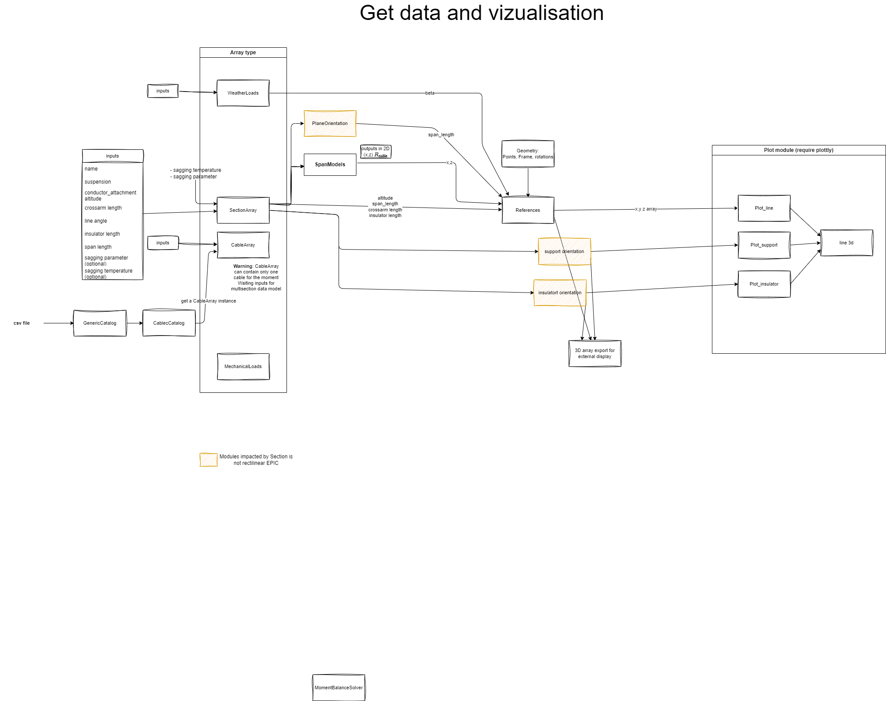

# Expected modules 

This page describes the expected modules for the mechaphlowers project.

The modules are divided into different types:
- Visualisation and data handling
- conversion
- solvers

## Visualisation

