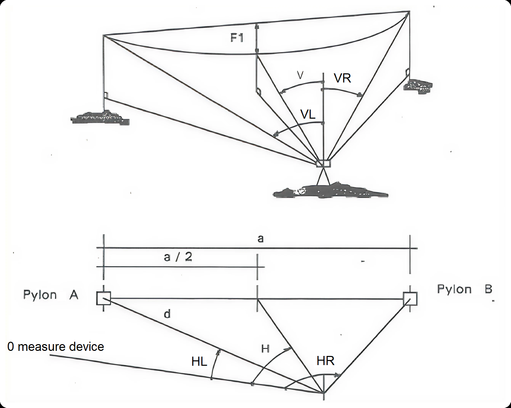

# Cable Adjustment

## Input data

* span_length
* HL: horizontal angle with left support, in rad
* VL: vertical angle with left support, in rad
* HR: horizontal angle with right support, in rad
* VR: vertical angle with right support, in rad
* dist_support: distance between the station and the studied support, in meters
* parameter: target sagging parameter
* side: specify which support dist_support is referring to. "left" or "right".

The angles HL, VL, HR, VR are defined as followed:



Currently all the angles (input and output) are clockwise-oriented

## Example of use

```py
a = 500
HG = 0
VG = 30
HD = 90
VD = 50
horizontal_distance_support = 300
parameter = 2000
result = compute_adjustment_angles(
    a,
    Q_(HG, "grad").to("rad").magnitude,
    Q_(VG, "grad").to("rad").magnitude,
    Q_(HD, "grad").to("rad").magnitude,
    Q_(VD, "grad").to("rad").magnitude,
    horizontal_distance_support,
    parameter,
    "left",
# Returns tuple of angles (H, V)
)
```
