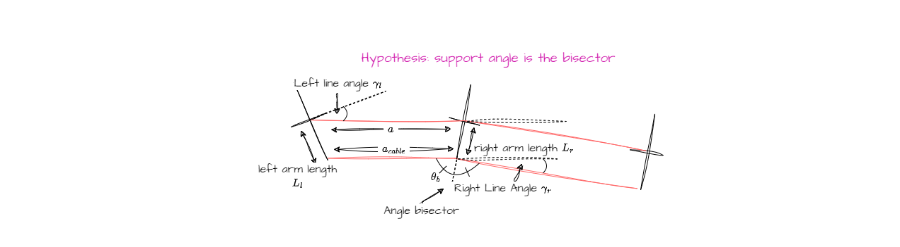

The cable modelisation is divided in two parts:  

- The space positioning part: the model used for plotting the 3D curve.
- The physic part: the model used for physics calculations.

This division is only for the sake of clarity. Indeed, the space positioning part is linked to the physic part through the parameter p.

# Space positioning cable model

## Input 

- $a$ the span length
- $b$ the elevation difference
- $p$ the sagging parameter

### Frame

Models detailed below are all in the cable frame. Here are the formulae linking span frame and cable frame.

### When cable is not vertical 

The cable equation is expressed in the cable frame, depending on $\beta$. 
The cable plane is "opening" due to the elevation difference with an angle $\alpha$.  
$\alpha$ can be expressed depending on beta:

$$
    \alpha = \arctan \left( \frac{b \cdot \sin \beta}{a} \right) = \arccos \left( \frac{a}{\sqrt{a^2 + ( b \cdot \sin \beta)^2}} \right)
$$

in the new cable plane, a and b become respectively a' and b'

$$
    a' = \sqrt{a^2+(b \cdot \sin\beta)^2} 
$$

$$
    b' = b \cdot \cos \beta
$$  

Another way to see the cable plane is to rotate the cable plane.

### When there are line angles and/or different arm length

The expression of $a_{cable}$ is:

$$
    a_{cable} = \sqrt{ \left( a - L_l \cdot \sin \gamma_l - L_r \cdot \sin \gamma_r \right) ^2 + \left( L_r \cdot \cos \gamma_r - L_l \cdot \sin \gamma_l \right) ^2 }
$$

Another way could be working in the complex plane: coordinates of M and N points can be calculated from span length with one translation and one rotation. A simple distance between new points gives $a_{cable}$.

## Catenary model

### Cable equation

The catenary model can be written as the following:

$$
    z(x) = p \cdot \left( \cosh \left( \frac{x}{p} \right) - 1 \right)
$$

In order to take the right piece of the curve, the extremum abscissa have to be calculated function of the cable parameter, in the cable's plane.
Let M the left hanging point and N the right hanging point. The cable plane defined in the general concepts is recalled here. 

$a$ and $b$ are expressed in the vertical plane. The equations that follow use $a'$ and $b'$ so they can be applied without considering $\beta$.

$$
    x_m = -\frac{a'}{2}+p \cdot asinh \left( \frac{b'}{2 \cdot p \cdot \sinh⁡ \left( \frac{a'}{2 \cdot p} \right)}  \right)
$$

$$
    x_n = a' + x_m
$$

The cable length can be divided into two parts:

$$
    L = L_m + L_n
$$

$$
    L_m = -p \cdot \sinh \left( \frac{x_m}{p} \right)
$$

$$
    L_n = p \cdot \sinh \left( \frac{x_n}{p} \right)
$$

### Tension

The cable equation has an impact on the definition of the mechanical tensions of the cable:

$$T_h = p \cdot m \cdot \lambda$$

with m the load coefficient. No load on cable means $m = 1$.

$$
    T_v(x) = T_h \cdot \sinh \left( \frac{x}{p} \right)
$$

$$
    T_{max} = T_h \cdot \cosh⁡ \left( \frac{x}{p} \right)
$$

$$
    {T_{mean}}_m = \frac{-x_m \cdot T_h + L_m \cdot {T_{max}}_m}{(2 \cdot L_m}
$$

$$
    {T_{mean}}_n = \frac{x_n \cdot T_h + L_n \cdot {T_{max}}_n}{2 \cdot L_n}
$$

$$
    T_{mean} = \frac{{T_{mean}}_{m} \cdot L_m+{T_{mean}}_{n} \cdot L_n}{L}
$$

## Parabola model
..

## Elastic catenary model
..

# Physics-based cable model

## Cable's physics properties

- $S$: section in $mm^2$
- $D$: diameter in $mm$
- $\lambda$: linear weight in $N/m$
- $E$: Young modulus in $MPa$
- $\alpha_{th}$: dilatation coefficient in $°C^{-1}$

## Extension and unstressed cable length

The cable is strained when subjected to mechanical tensions or thermal changes.

- mechanical part due to tension $T_{mean}$ :
$\varepsilon_{mecha} = \frac{T_{mean}}{E\cdot S}$

- thermal part due to temperature $\theta$ :
$\varepsilon_{therm} = \theta \cdot \alpha_{th}$

The total strain is : 

$$\varepsilon_{total} = \varepsilon_{mecha} + \varepsilon_{therm} = \frac{\Delta L}{L_0} = \frac{L - L_0}{L_0}$$

The unstressed cable length $L_0$ can be then expressed as the following: 

$$L_0 = \frac{L}{1+\varepsilon_{total}}$$

