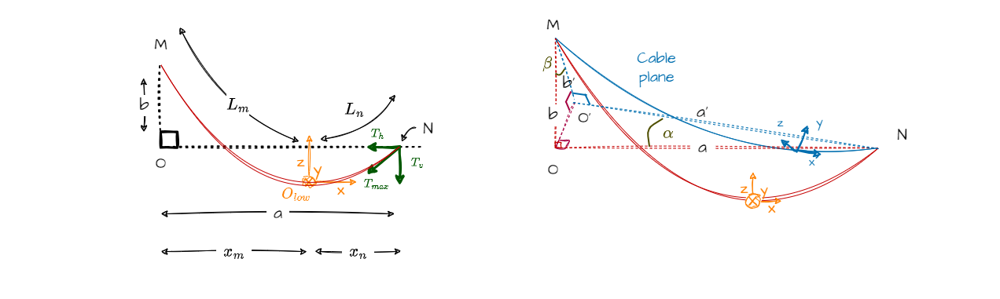

The cable modeling is divided into two parts:

- The space positioning part: the model used for plotting the 3D curve.
- The physics part: the model used for physics calculations.

This division is for clarity purposes only. The space positioning part is linked to the physics part through the parameter $p$.

## Span cable modeling

### Inputs

- $a$ the span length
- $b$ the elevation difference
- $p$ the sagging parameter

The cable equation is expressed in the cable's frame, depending on $\beta$.  
The cable plane "opens" due to the elevation difference, forming an angle $\alpha$.

$\alpha$ can be expressed as a function of $\beta$:

$$
    \alpha = \arctan \left( \frac{b \cdot \sin \beta}{a} \right) = \arccos \left( \frac{a}{\sqrt{a^2 + (b \cdot \sin \beta)^2}} \right)
$$

In the new cable plane, $a$ and $b$ become $a'$ and $b'$, respectively:

$$
    a' = \sqrt{a^2 + (b \cdot \sin \beta)^2}
$$

$$
    b' = b \cdot \cos \beta
$$

Another way to see the cable plane is to rotate the cable plane.

### Catenary model

#### 1. Cable equation

The catenary model can be written as follows:

$$
    z(x) = p \cdot \left( \cosh \left( \frac{x}{p} \right) - 1 \right)
$$

To extract the appropriate curve segment, the extremum abscissa values ($x_m$ and $x_n$) must be calculated as
functions of the sagging parameter $p$ within the cable's plane. $x = 0$  represents the center of the cable. Let $M$ be
the left hanging point and $N$ the right hanging point. The cable plane, as defined in the general concepts, is recalled
here. $a$ and $b$ are expressed in the vertical plane. The following equations use $a'$ and $b'$, so they can be applied
without considering $\beta$:

$$
    x_m = -\frac{a'}{2}+p \cdot asinh \left( \frac{b'}{2 \cdot p \cdot \sinh⁡ \left( \frac{a'}{2 \cdot p} \right)}  \right)
$$

$$
    x_n = a' + x_m
$$

The cable length $L$ can be divided into two parts:

$$
    L = L_m + L_n
$$

where

$$
    L_m = -p \cdot \sinh \left( \frac{x_m}{p} \right)
$$

and 

$$
    L_n = p \cdot \sinh \left( \frac{x_n}{p} \right)
$$

#### 2. Tension

The cable equation has an impact on mechanical tension definition. The mechanical tension is separated into two parts:

1. The horizontal component 

$$
    T_h = p \cdot mass \cdot \lambda
$$

with $m$ the load coefficient. No load on cable means $mass = 1$. It is constant along the cable.

1. The vertical component

$$
    T_v(x) = T_h \cdot \sinh \left( \frac{x}{p} \right)
$$

Then, the maximal tension $T_{max}$, function of $x$, is a combination of these two components:

$$
    T_{max}(x) = \sqrt{T_h^2 + T_v(x)^2}
$$

$$
    T_{max}(x) = T_h \cdot \cosh⁡ \left( \frac{x}{p} \right)
$$

To understand the tension distribution along the cable, we calculate the mean tensions at its extremities
$M$ and $N$, through integrals, as well as the overall mean tension. The mean tensions at $M$ (left) and $N$ (right) are given by:

$$
{T_{mean}}_m = \frac{-x_m \cdot T_h + L_m \cdot {T_{max}}_m}{2 \cdot L_m}
$$

and

$$
{T_{mean}}_n = \frac{x_n \cdot T_h + L_n \cdot {T_{max}}_n}{2 \cdot L_n}
$$

Where $x_m, x_n$ are the horizontal positions at $M$ and $N$, $T_h$ is the constant horizontal tension,
and $L_m, L_n$ are the cable lengths around the extremities. The tensions reached their maximum at the extremities. 
The overall mean tension is the weighted average of the extremity tensions:

$$
T_{mean} = \frac{{T_{mean}}_m \cdot L_m + {T_{mean}}_n \cdot L_n}{L}
$$

with $L = L_m + L_n$ the total cable length. These expressions provide a global and local understanding of
how the forces are distributed along the cable, essential for analyzing strain and deformation.

### Additional models

#### Parabola model
(*To be developed later.*)

#### Elastic catenary model
(*To be developed later.*)

## Physics-based cable modeling

### Physical properties of the cable

- $S$ the cross-sectional area, in $mm^2$
- $D$ the diameter, in $mm$
- $\lambda$ the linear weight, in $N/m$
- $E$ the Young's modulus, in $GPa$
- $\alpha_{th}$ the thermal expansion coefficient, in $°C^{-1}$

### Linear elasticity model

In this section, the cable is assumed to exhibit linear elasticity, meaning its strain is directly proportional to
stress. More complex behaviors (e.g., plasticity) can be added in the future.

The cable's strain results from two sources, mechanical tensions and temperature changes:

1. Mechanical strain due to tension $T_{mean}$:

$$
    \varepsilon_{mecha} = \frac{T_{mean}}{E \cdot S}
$$

2. Thermal strain due to temperature $\theta$:

$$
    \varepsilon_{therm} = (\theta - \theta_{ref}) \cdot \alpha_{th}
$$

Where $\theta_{ref}$ is the reference temperature used to define the unstressed cable length.

The total strain is:

$$
    \varepsilon_{total} = \varepsilon_{mecha} + \varepsilon_{therm} = \frac{\Delta L}{L_{ref}} = \frac{L - L_{ref}}{L_{ref}}
$$

with the unstressed cable length $L_{ref}$:

$$
    L_{ref} = \frac{L}{1 + \varepsilon_{total}}
$$

