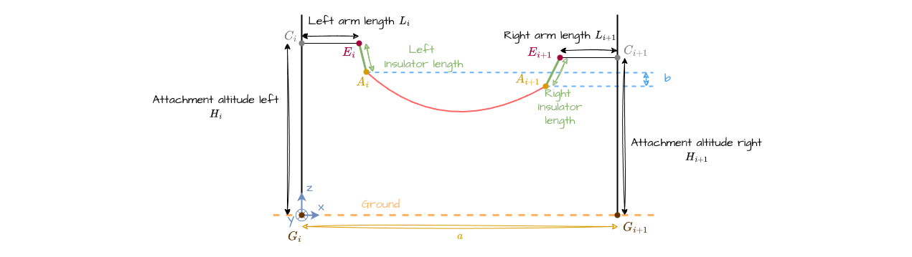

The cable modelisation is divided in two parts:  

- The space positioning part: the model used for plotting the 3D curve.
- The physic part: the model used for physics calculations.

This division is only for the sake of clarity. Indeed, the space positioning part is linked to the physic part through the parameter p.

## Span cable model

### Input 

- $a$ the span length
- $b$ the elevation difference
- $p$ the sagging parameter

The cable equation is expressed in the cable frame, depending on $\beta$. 
The cable plane is "opening" due to the elevation difference with an angle $\alpha$.  
$\alpha$ can be expressed depending on beta:

$$
    \alpha = \arctan \left( \frac{b \cdot \sin \beta}{a} \right) = \arccos \left( \frac{a}{\sqrt{a^2 + ( b \cdot \sin \beta)^2}} \right)
$$

in the new cable plane, a and b become respectively a' and b'

$$
    a' = \sqrt{a^2+(b \cdot \sin\beta)^2} 
$$

$$
    b' = b \cdot \cos \beta
$$  

Another way to see the cable plane is to rotate the cable plane.

### Line angles and arm lengths

We want to compute $a_{cable}$ and $b_{cable}$ depending on $a$, the line angles, the arm lengths and the chain deplacements

$A_i$ and $A_{i+1}$ (**attachments points**) are the points where cable is attached at the end of the suspension chains, respectively on left and right support. These are the points we want at the end.

$E_i$ and $E_{i+1}$ (**edge_arm points**) are the points of the end of the arms, respectively on left and right support

$C_i$ and $C_{i+1}$ (**center_arm points**) are the points on the support where the arms are attached

$G_i$ and $G_{i+1}$ (**support ground points**) are the points on the ground where the support is set. More precisely, this point is the barycenter of the legs of the support.

$a_{cable} = \sqrt{(x_{A_i}-x_{A_{i+1}})^2 + (y_{A_i}-y_{A_{i+1}})^2}$

$b_{cable} = |z_{A_i}z_{A_{i+1}}|$

We want the coordinates of $A_i$ and $A_{i+1}$ in the span frame of the support $i$

#### Computing support ground $G_i$ coordinates

Support ground coordinates $G_i$ are built recursively. Starting from $G_i$, we can build $\overrightarrow{G_{i}G_{i+1}}$, then get coordinates of $G_{i+1}$

$\overrightarrow{G_{i}G_{i+1}}$ length is $a$. Its direction can be determined using the line angles $\gamma_i$

Then center arm coordinates $C_i$ can be easily computed by adding the altitude of the arm.

#### Computing edge arms $E_i$ coordinates

In order to get $E_i$, we use point $E_i'$, which is the equivalent point if there wasn't any line angle.\
Coordinates of $E_i'$ are $(x_{C_i}, L_l, z_{C_i})$. Same x and z coordinates than center arm points, but with an arm length along the y axis.\
Then we can get $E_i$ by applying a rotation of $-\frac{\gamma_{l}}{2}$ around the z axis.

Same thing for $E_{i+1}$, we use point $E_{i+1}'$.\
Coordinates of $E_{i+1}'$ are $(x_{C_{i+1}}, L_l, z_{C_{i+1}})$.\
Then we can get $E_{i+1}$ by applying a rotation of $+\frac{\gamma_{l}}{2}$ around the z axis.

#### Computing attachement $A_i$ coordinates

From coordinates of $E_i$ and $E_{i+1}$, you can get coordinates of $A_i$ and $A_{i+1}$, by adding $dep_x$ and $dep_y$ to their coordinates. 

$dep_z$ can be calculated using the two other coordinates and the insulator length (TODO).

### Catenary model

#### 1. Cable equation
The catenary model can be written as the following:

$$
    z(x) = p \cdot \left( \cosh \left( \frac{x}{p} \right) - 1 \right)
$$

In order to take the right piece of the curve, the extremum abscissa have to be calculated function of the cable parameter, in the cable's plane.
Let M the left hanging point and N the right hanging point. The cable plane defined in the general concepts is recalled here. 

$a$ and $b$ are expressed in the vertical plane. The equations that follow use $a'$ and $b'$ so they can be applied without considering $\beta$.

$$
    x_m = -\frac{a'}{2}+p \cdot asinh \left( \frac{b'}{2 \cdot p \cdot \sinh⁡ \left( \frac{a'}{2 \cdot p} \right)}  \right)
$$

$$
    x_n = a' + x_m
$$

The cable length can be divided into two parts:

$$
    L = L_m + L_n
$$

$$
    L_m = -p \cdot \sinh \left( \frac{x_m}{p} \right)
$$

$$
    L_n = p \cdot \sinh \left( \frac{x_n}{p} \right)
$$

#### 2. Tension

The cable equation has an impact on the definition of the mechanical tensions of the cable:

$$T_h = p \cdot m \cdot \lambda$$

with m the load coefficient. No load on cable means $m = 1$.

$$
    T_v(x) = T_h \cdot \sinh \left( \frac{x}{p} \right)
$$

$$
    T_{max} = T_h \cdot \cosh⁡ \left( \frac{x}{p} \right)
$$

$$
    {T_{mean}}_m = \frac{-x_m \cdot T_h + L_m \cdot {T_{max}}_m}{2 \cdot L_m}
$$

$$
    {T_{mean}}_n = \frac{x_n \cdot T_h + L_n \cdot {T_{max}}_n}{2 \cdot L_n}
$$

$$
    T_{mean} = \frac{{T_{mean}}_{m} \cdot L_m+{T_{mean}}_{n} \cdot L_n}{L}
$$

### Parabola model
..

### Elastic catenary model
..

## Physics-based cable model

### Cable's physics properties

- $S$: section in $mm^2$
- $D$: diameter in $mm$
- $\lambda$: linear weight in $N/m$
- $E$: Young modulus in $GPa$
- $\alpha_{th}$: dilatation coefficient in $°C^{-1}$

### Linear elasticity model

In this section, we assume the cable exhibits linear elasticity and can be described by a linear relation between stress and strain. More complex behaviors (such as plasticity) may be added later.

The cable is strained when subjected to mechanical tensions or thermal changes.

- mechanical part due to tension $T_{mean}$ :
$\varepsilon_{mecha} = \frac{T_{mean}}{E\cdot S}$

- thermal part due to temperature $\theta$ :
$\varepsilon_{therm} = (\theta - \theta_{ref}) \cdot \alpha_{th}$

$\theta_{ref}$ being the reference temperature chosen to define the unstressed cable length.

The total strain is : 

$$\varepsilon_{total} = \varepsilon_{mecha} + \varepsilon_{therm} = \frac{\Delta L}{L_{ref}} = \frac{L - L_{ref}}{L_{ref}}$$

The unstressed cable length $L_{ref}$ can be then expressed as the following: 

$$L_{ref} = \frac{L}{1+\varepsilon_{total}}$$

