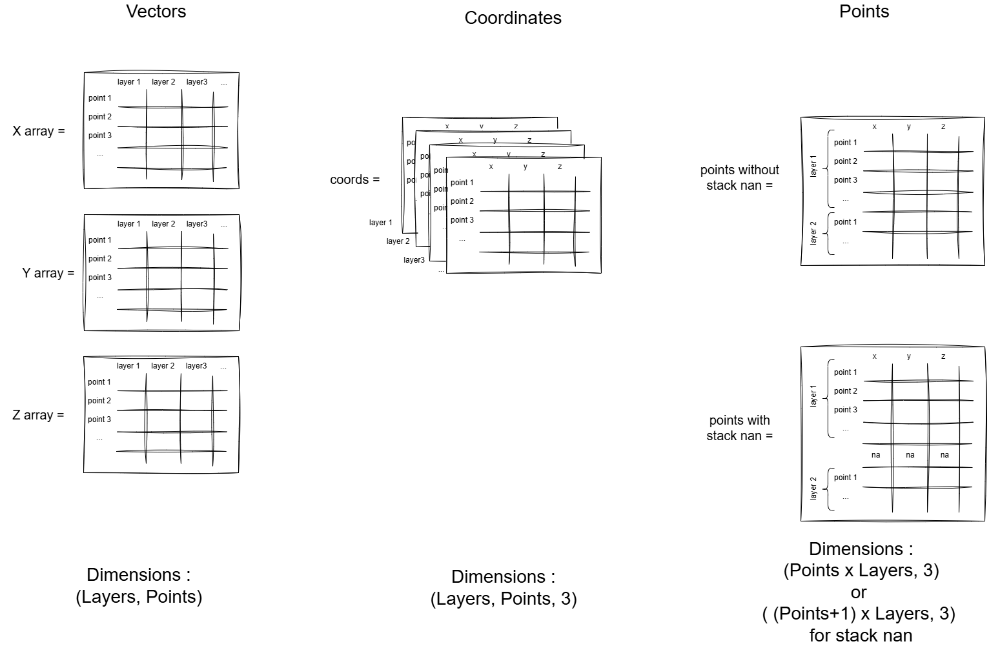

# Mechaphlower Coordinates System

Mechaphlower provides a set of tools to handle coordinates in 3D space.  
The philosophy is to store the same objects with the same resolution as layers of a coordinate system. In this way, calculations can be performed on all layers at once.

## Formats

There are three format used:

- **Vectors**: A tuple of three 2D numpy arrays, each representing the x, y, and z coordinates of a set of points. The shape of each array is (number of layers, number of points).
- **Coordinates**: A 3D numpy arrays with shape (number of layers, number of points, 3), where the last dimension represents the x, y, and z coordinates of each point.
- **Points**: A 2D numpy array with shape (number of points, 3). The points are a flattened version of the coordinates array, where each row is a point (x, y, z). The points loose the layer information.

!!! note
    The points format can be generated with a stack_nan option, which stacks the points of all layers on top of each other, separated by NaN. In this way, scatters of each objects can be plotted separately in a single plot. And the layers are preserved.



## Provided classes

### Points
The `Points` class is used to handle a set of points in 3D space. It provides methods to convert the coordinates to vectors, points, and to create a Points object from vectors or coordinates.  
Inside, the data are stored as coordinates, which are more convenient to manipulate.

Example:
```python
import numpy as np
from mechaphlowers.core.geometry.points import Points

# Create vectors for two layers with 4 points each
x = np.array([[1.0, 2.0, 3.0, 4.0], [5.0, 6.0, 7.0, 8.0]]).T
y = np.array([[0.0, 0.0, 0.0, 0.0], [-1.0, -1.0, -1.0, -1.0]]).T
z = np.array([[10.0, 20.0, 30.0, 40.0], [40.0, 30.0, 20.0, 10.0]]).T

# Create a Points object from vectors
points = Points.from_vectors(x, y, z)

# Get coords format
coords = points.coords

# Get vectors format
x, y, z = points.vectors

# Convert to points
points = points.to_points()

# Convert to points with nan stacked between layers for plotly visualization
points = points.to_points(stack=True)

# You can also create a Points object from coordinates
points = Points.from_coords(coords)
```

### SectionPoints
The `SectionPoints` class is used to handle all the points of a section.  
It is useful to get the points of a section in a specific format.  
The class provides helpers to get the points in different frames:
    - cable frame
    - localsection frame
    - support frame
    - section frame

!!! warning
    For the moment only the spans are available in different frames. Insulators and supports are only available in the section frame.

To get the different section points, all you need is to input the section parameters, a span model to generate the span shape and use the getter methods.  
You can also add a wind load using the beta parameter.  
The span model can be changed using the init_span method.

Example:
```python
import numpy as np
import pandas as pd

from mechaphlowers.core.geometry.points import SectionPoints
from mechaphlowers.entities.arrays import SectionArray
from mechaphlowers.core.models.cable.span import CatenarySpan

section_array = SectionArray(
        pd.DataFrame(
            {
                "name": np.array(["support 1", "2", "three", "support 4"]),
                "suspension": np.array([False, True, True, False]),
                "conductor_attachment_altitude": np.array([30, 40, 60, 70]),
                "crossarm_length": np.array([40, 20, -30, -50]),
                "line_angle": np.array([0, -45, 60, -30]),
                "insulator_length": np.array([0, 5, 82, 0]),
                "span_length": np.array([500, 460, 520, np.nan]),
            }
        )
    )
section_array.sagging_parameter = 2000
section_array.sagging_temperature = 15

span_model = CatenarySpan(**section_array.to_numpy())

s = SectionPoints(
    span_model=span_model, 
    **section_array.to_numpy()
)


from plotly import graph_objects as go
from mechaphlowers.plotting.plot import plot_points_3d, set_layout
fig = go.Figure()
# plot spans in cable frames
plot_points_3d(fig, s.get_spans("cable").points(True))
# plot spans in crossarm frames
plot_points_3d(fig, s.get_spans("localsection").points(True))
# plot spans in section frames
plot_points_3d(fig, s.get_spans("section").points(True))

# plot supports and insulators in section frames
plot_points_3d(fig, s.get_supports().points(True))
plot_points_3d(fig, s.get_insulators().points(True))

set_layout(fig)
fig.show()
```

## How does span engine work?

As you can see in the following graph, the span engine is generating the spans in the cable frame with origin at the lowest point of the span.  
Then we change the spans generated from the cable frame to the crossarm frame and finally to the section frame.  
You can click on the legend to hide successively the fourth steps of the span engine.

--8<-- "docs/user_guide/assets/how_span_engine_work.html"

!!! note
    The beta angle is set before the cable plane generation. That is why the spans in the first step are not in the same plane.