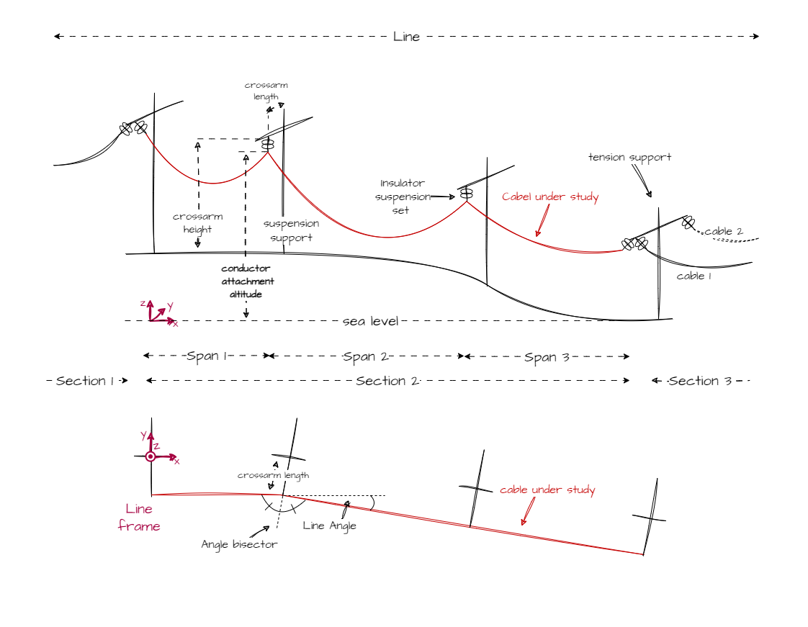
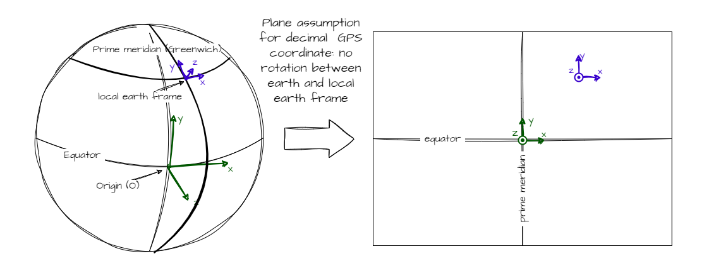
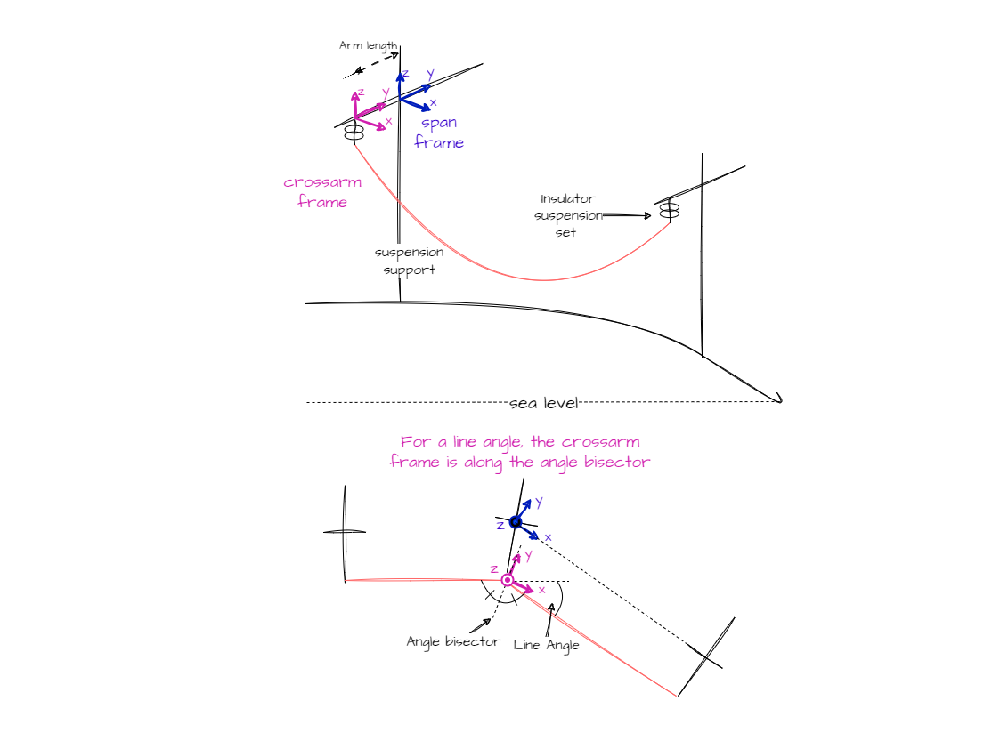
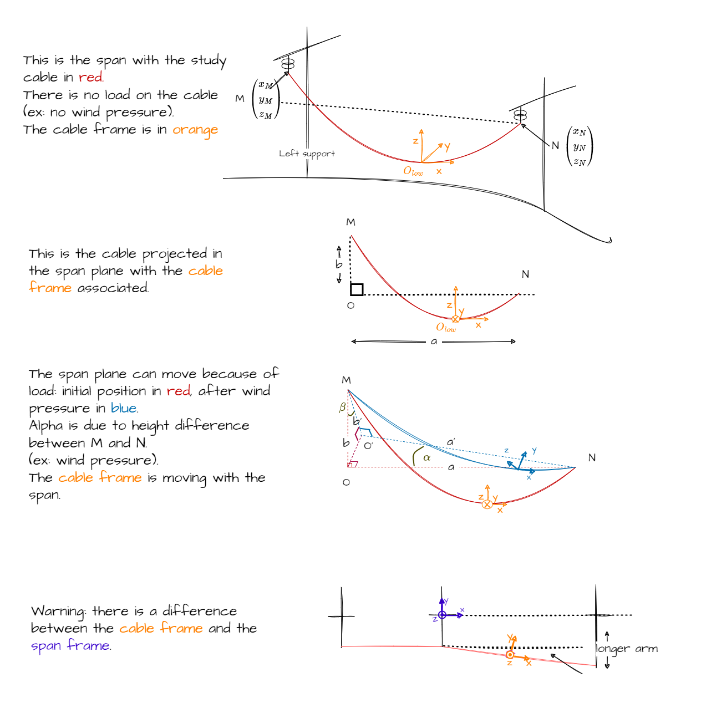
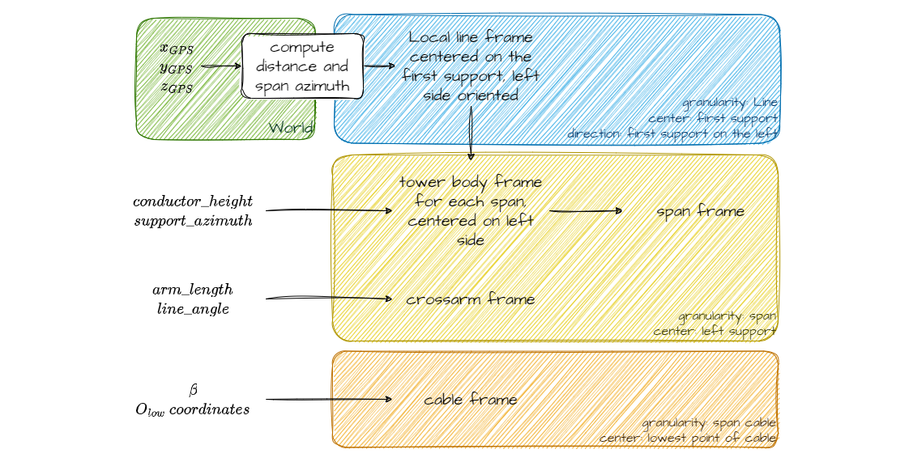

# General concepts

MechaPhlowers is a library specialized to perform mechanical and geometrical calculus for powerlines. The models are designed to be the simplest and most accurate possible : when possible, calculus are performed in 2D planes.

The granularity is important : the line is composed by several section. For each section, there are several cables. Each cable can be divided into spans, which is the lowest scale of calculus.

The algorithms are switching between the different levels during the resolution.

## Definition

As described below, the study cable is hanging to different suspension strings and start/stopping to a tension support.

Occasionnaly, some line angles can be found into a section. In this case, we are considering the axe of the pylone (i.e. the arm direction) as the angle bisector.

## Frames

Depending on the physical models used in the algorithms, the 3D objects, coordinates, forces and moments are projected onto different planes.

Understanding these planes is not required to use the package, but it is necessary if you wish to explore the various physical models employed.

However, the different frames defined below are necessary to display the results. Therefore, we are outlining the transformation operations to transition between them.

### Earth frame

#### Base frame

The Earth frame  $\mathcal{R}_{earth}$ is defined as the GPS coordinates system :

- x along the west-east axis, facing east
- y along the north-south axis, facing north
- x and y in the plan, z is orthogonal to this plan
- the origin of the frame is the crossing of equator and prime meridian.

!!! important

    For now, only the local frame is considered (in blue in the figure), with the hypotheses that the origin is a plane translation relative to the O point in the figure.

#### Georeferencing

Other coordinates system may be added in the future.

### Support frame

There are two frames associated with the support:

- The tower body frame: $\mathcal{R}_{towerbody}$
- The crossarm frame: $\mathcal{R}_{crossarm}$

Those frames are oriented with z axis up and x axis along the crossarm, pointing outwards from the pylon.

!!! important

    In mechaphlowers, the _arm length_ is not the distance between the center and the end of the support, but between the center and the insulator attachment point.

### Cable frame / Span frame

The reference support frame for a span is the left support depending on line direction evolution.

The cable frame $\mathcal{R}_{cable}$ is defined as described in the figure below. This frame is then moving depending on cable loads.

Below a figure to help seeing the cable plane

--8<-- "docs/user_guide/assets/moving_projection_and_cable.html"

### Strategy

- State changes, unstrained length are performed in the cable plane
- The equilibrium of moment is performed in the crossarm frame
- The 2D visualisation "span-oriented" is a projection on the span frame.
- The 3D visualisation is performed using line frame and could be done with local earth frame too

### Changing frames

