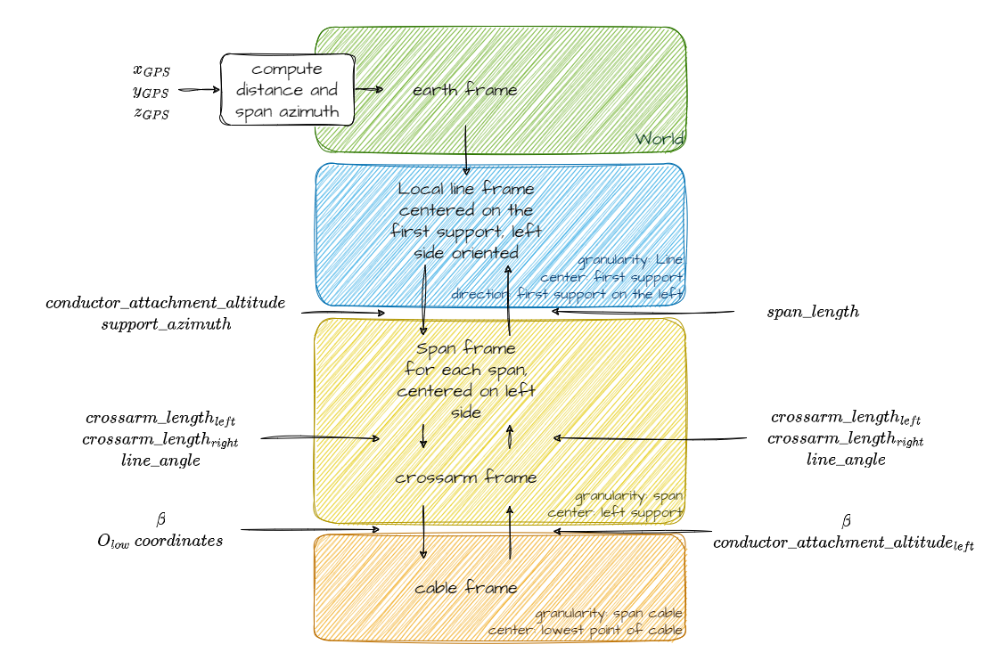

# General concepts

MechaPhlowers is a library specialized in performing mechanical and geometrical calculations for power lines. The models are designed to be as simple and accurate as possible: whenever appropriate, calculations are performed in 2D planes.

Granularity is important: the power line is divided into sections, which are further divided into spans, considered as the smallest units for calculations. Only one phase is studied at a time. A phase consists of a single conductor, a bundle of wires, or an earth wire. Henceforth, the generic term cable will be used to refer to such objects.

## Definition

As shown in the figure, the cable under study is suspended from suspension insulators and anchored to dead-end insulators.

There may be some angle point in each section. In such cases, the axis of the angle support arm aligns with the bisector of the line's angle.

## Frames

Depending on the mathematical models used in the algorithms, 3D objects, coordinates, forces and moments are projected onto different planes. 
It isn't necessary to understand those different planes in order to use the package, unless a deeper understanding of the mathematical models is desired.
Since the different frames described in the figure are necessary to display the results of the calculations, it is important to explain how to transition from one frame to another.

### Earth frame

#### Base frame

The Earth frame $\mathcal{R}_{earth}$ is defined as in the GPS coordinate system :

- x along the west-east axis, facing east
- y along the north-south axis, facing north
- x and y in the plan, z orthogonal to this plan
- the origin of the frame is the crossing of equator and prime meridian.

!!! important

    For now, only the local frame (in blue in the figure) is considered, with the assumption that the origin is a plane translation relative to point O in the figure.

#### Georeferencing

Other coordinate systems may be added in the future.

### Support frame

There are two frames associated with the support:

- The span frame: $\mathcal{R}_{span}$
- The crossarm frame: $\mathcal{R}_{crossarm}$

Those frames are oriented with the z-axis up and the y-axis along the crossarm, pointing inward from the pylon.

!!! important

    - In mechaphlowers, the __crossarm length__ is not the distance between the center and the end of the support, but between the center and the insulator attachment point.
    - The __conductor's attachment altitude__ might not be immediately obvious: it refers to the height of the attachment point above sea level  

### Cable frame / Span frame

The reference support frame for a span is the left support depending on line direction evolution.

The cable frame $\mathcal{R}_{cable}$ is defined as described in the figure below. This frame can move depending on the cable loads.

Below a figure to help seeing the cable plane

--8<-- "docs/user_guide/assets/moving_projection_and_cable.html"

### Strategy

- State changes, unstrained length are performed in the cable plane
- The equilibrium of moment is performed in the crossarm frame
- The 2D visualisation "span-oriented" is a projection on the span frame.
- The 3D visualisation is performed using line frame and could be done with local earth frame too

### Changing frames

