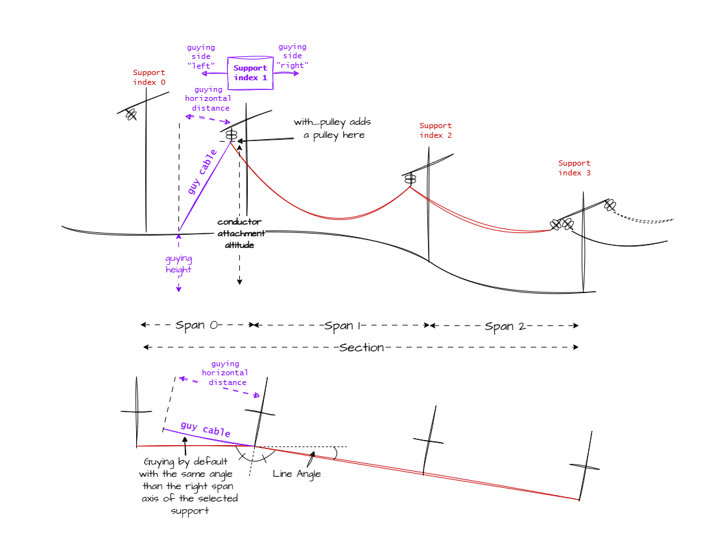
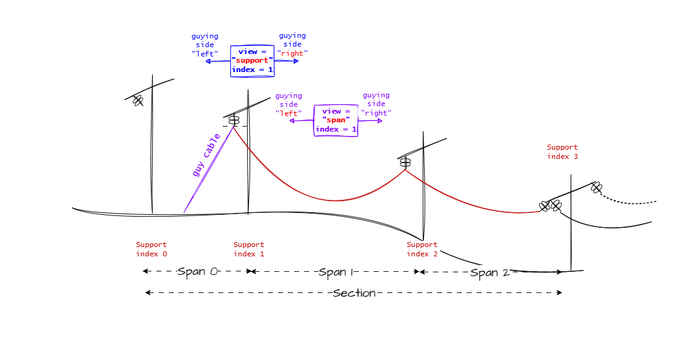

# Guying

## Overview

Mechaphlowers provides simple guying calculations necessary for field work involving guy cables. The guying module calculates the forces in guy cables and the associated vertical, horizontal, and longitudinal loads.

Guying is performed by using the loads at the selected support (the VHL - Vertical, Horizontal, Longitudinal loads) which are themselves calculated via the balance physics engine.

### Key Features

- **Guy cable tension calculation**: Determines the tension in the guy cable based on geometry and applied loads
- **Load analysis**: Calculates the vertical, horizontal, and longitudinal components of forces
- **Support with or without pulley**: Allows modeling of two different configurations
- **Side management**: Supports guying on the left or right side of the support

!!! Warning

    The naming of _left_ and _right_ for guying may be confusing. Note that for a selected support, if you guy to the _left_ of the support, you need to retrieve the VHL to the _right_ of the support, as seen in the code.

!!! Assumption

    When there is an angle in the line, the guy cable is placed along the span axis. (see chart)

## Geometric Configuration

It is possible to use a pulley on suspension supports (neither the first nor the last support). The configuration without a pulley corresponds to a direct guy cable, while the configuration with a pulley uses the span tension to calculate the tension in the guy cable.



!!! Warning

    In the chart below you can see the impact of the **view** parameter.  
    Be careful to the point of view you choose when setting guying parameters. Indeed left guying side with span centered view is equivalent to right guying side  with support centered view

    


## Usage Example

Here is a complete example showing how to calculate guying efforts:

```python
import pandas as pd
import numpy as np
from mechaphlowers.core.models.balance.engine import BalanceEngine
from mechaphlowers.core.models.guying import Guying
from mechaphlowers.data.catalog import sample_cable_catalog
from mechaphlowers.entities.arrays import SectionArray

# Create a simple tower profile with 4 supports
section_data = pd.DataFrame({
    "name": ["1", "2", "3", "4"],
    "suspension": [False, True, True, False],
    "conductor_attachment_altitude": [30, 30, 30, 30],  # conductor attachment altitude (m)
    "crossarm_length": [0, 0, 0, 0],  # crossarm length (m)
    "line_angle": [0, 0, 0, 0],  # line deflection angle (grad)
    "insulator_length": [0.01, 3, 3, 0.01],  # insulator chain length (m)
    "span_length": [400, 400, 400, np.nan],  # span length (m)
    "insulator_mass": [0, 100, 100, 0],  # insulator mass (kg)
    "load_mass": [0, 0, 0, np.nan],  # additional load mass (kg)
    "load_position": [0.2, 0.4, 0.6, np.nan],  # relative load position
})

section_array = SectionArray(
    section_data,
    sagging_parameter=2000,  # sagging parameter (daN)
    sagging_temperature=15,  # reference temperature (°C)
)

# Get cable from catalog
from mechaphlowers.data.catalog import sample_cable_catalog

cable_array = sample_cable_catalog.get_as_object(["ASTER600"])

# Initialize the balance engine
balance_engine = BalanceEngine(
    cable_array=cable_array,
    section_array=section_array,
)

# Solve equilibrium
balance_engine.solve_adjustment()
balance_engine.solve_change_state(
    new_temperature=15,
    wind_pressure=0,
)

# Create the guying calculation instance
guying = Guying(balance_engine)

# Calculate guying efforts at support 1 (suspension support)
# Without pulley, guy cable on the left side of the support
guying_results = guying.get_guying_results(
    support_index=1,
    with_pulley=False,
    guying_altitude=0,  # guy cable attachment altitude (m)
    guying_horizontal_distance=50,  # horizontal distance to anchorage (m)
    guying_side='left',
)

# Display results
print(guying_results)

# Access individual results
print(f"Guy cable tension: {guying_results.guying_tension}")
print(f"Vertical load: {guying_results.vertical_force}")
print(f"Longitudinal load: {guying_results.longitudinal_force}")
print(f"Guy cable angle: {guying_results.guying_angle_degrees}")

# Calculate efforts with pulley at support 2
guying_results_pulley = guying.get_guying_results(
    support_index=2,
    with_pulley=True,
    guying_altitude=0,
    guying_horizontal_distance=50,
    guying_side='right',
)

print(f"\nResults with pulley: {guying_results_pulley}")
```
