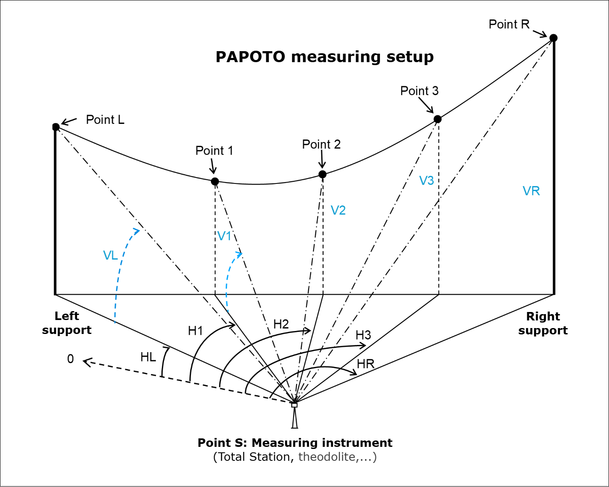

# Measures

## Parameter estimation

Ideally, the geometric verification of a span with respect to the requirements of the applicable Technical Decree should be carried out when the lowest conductor of that span is definitively at its maximum operating temperature, and this without any wind that could displace the conductor from its vertical plane (lateral clearance is therefore temporarily ignored). In such a case, it would suffice to measure the actual distance between the conductor and the various objects it overhangs (road, dwelling, agricultural land, etc.) to verify that the minimum regulatory clearances are respected.  
However, this situation is very rare, so a method is needed to estimate the vertical position the conductor would have if it were brought to its maximum operating temperature due to a high current flow through the line.  
The standard method involves the following calculation chain:

1.  Choose an equation representing the curve of a suspended cable.  
Practically, this corresponds to a catenary, which is fully defined by the span length, the elevation difference, and the so-called parameter (the ratio between the horizontal tension and the linear weight of the cable).

2. Measure the span length and elevation difference, and estimate the cable’s parameter from indirect measurements.

3. Estimate, again from indirect measurements, the cable temperature at the time the parameter was estimated.

4. Using both the estimated parameter and temperature, determine the adjustment parameter of the section to which the span belongs—i.e., the parameter at 15°C with no wind when the conductors are straight.

5. Finally, using a state change calculation, estimate the parameter and the position of the conductors in the studied span when the cable reaches its maximum operating temperature. This estimated position is then used to perform the regulatory clearance verification.

Different methods exists and mechaphlowers gives access to 3 of them:

- Papoto method
- Pep method
- Tangent aiming

### Papoto method

#### History

In 1977, the CRTT "Alpes" issued a handwritten document that appears to be the origin of the method now known as the PAPOTO method.  
This new method was particularly practical for its time, as it allowed for the determination of a cable span’s parameter:

- Without needing to be positioned directly beneath one of the suspension strings: the theodolite could be placed off the span’s axis and perform a lateral sighting.
- Without needing to know the distance between the theodolite and the cable’s attachment point under the suspension string: only the horizontal span length was required.
The 1977 document presented three variants:
- A lateral sighting using a base formed by two stakes 20 meters apart, with the span length to be determined (PAPAPO program).
- A lateral sighting without a base but with a known span length (PAPO program).
- A lateral sighting without a base and with the span length to be determined (one of the towers serves as the new base).

The variant used today is the second one, as modern measurement tools (such as total stations) make it easy to determine the horizontal span length by targeting the cable’s attachment points.  
The 1977 version of the PAPO method only considered the attachment points and two additional points located on the cable.  
The current method uses three points located on the cable. Each pair of points allows for the calculation of a parameter using the PAPO method, and comparing the three resulting parameters makes it possible to verify that the average estimate is generally reliable.  
It is speculated that the "TO" in PAPOTO comes from the French word for "three", possibly explaining the current name of the method: PAPO TrOis (times) … PAPOTO.
This method was first coded in the 1990s using one of the programmable calculators popular at the time. It is now part of the official tools offered by mechaphlowers and stellar, the maintenance software dedicated to the mechanical, geometric, and thermal calculations of overhead lines.

#### Calculus principles

A fundamental simplifying assumption must be made before explaining the PAPOTO method: the cable (whose representative curve is a catenary) is always assumed to lie in a perfectly vertical plane, thereby neglecting any wind influence.  
Once this implicit assumption is understood, imagine that the measuring device — nowadays a total station, denoted by S — forms a triangle with the two cable attachment points, denoted L and R (for the left and right points, respectively), when viewed from above.  
The horizontal distance $[LR]$ between the attachment points is known (it can be accurately measured using the total station), as is the angle $\widehat{LSR}$, which is directly measured.  
To fully define the triangle, one more element is needed—either another side $[SL]$ or $[SR]$, or another angle such as $\widehat{RLS}$ or $\widehat{SRL}$.  
This is where the PAPOTO method begins: with an initial value for the angle $\widehat{SRL}$, which is then iteratively refined using a bisection method to converge toward its true value.

Notations: 

$$
    \begin{aligned}
        \alpha &= \widehat{LSR}  \\
        \alpha_R &= \widehat{SRL}  \\  
        \alpha_L &= \widehat{RLS}  \\
        a &= [LR] \text{ (horizontal span)}  \\
        \text{dist}_R &= [SR]  \\
        \text{dist}_L &= [SL]  \\
    \end{aligned}
$$

If the angle $\alpha_R​$ is known, then $\alpha_L$​ can be easily calculated as:

$$
    \begin{aligned}
    \alpha_L &= \pi−\alpha_R−\alpha \\
    \end{aligned}
$$

Knowing the three angles of the triangle and the span length $a$, the other two sides can be calculated as:

$$
    \begin{aligned}
        \text{dist}_L &= \frac{a}{\sin \alpha} \cdot \sin \alpha_R \\
        \text{dist}_R &= \text{dist}_L \cdot \cos \alpha + a \cdot \cos \alpha_R
    \end{aligned}
$$

The total station can measure both horizontal and vertical angles. For clarity: $H_L$​ and $H_R$​ are the horizontal angles observed by the station for the attachment points, already converted to radians. Thus:

$$
    \alpha = H_R - H_L
$$

$V_L$​ and $V_R$​ are the vertical angles observed by the station, also converted to radians, with the convention that zero corresponds to the horizontal (note: for the station, zero corresponds to the zenith, so an intermediate conversion is required). Vertical angles are positive above the horizon.

Using the vertical angles $V_L$​ and $V_R$​, the altitudes $z_L$​ and $z_R$​ of the left and right points relative to the station’s altitude can be determined, as well as the elevation difference $h$:

$$
    \begin{aligned}
        z_L &= \text{dist}_L \cdot \tan(V_L) \\
        z_R &= \text{dist}_R \cdot \tan(V_R) \\
        h &= z_R - z_L
    \end{aligned}
$$

From this point on, it is necessary to use the angles of points 1 and 2 located on the span: $H_1$, $H_2$, $V_1$, and $V_2$, in order to determine:

- The distances $\text{dist}_1$ and $\text{dist}_2$, which are the distances from the station to points 1 and 2
- The lengths $a_1$ and $a_2$, which are the horizontal distances from the left attachment point to points 1 and 2

For the method to work, point 1 must be located to the left of point 2.
The previous calculations in triangle SLR can be applied to triangles SL1 and SL2, so it is now preferable to use the following notation:

$$
    \begin{aligned}
        \alpha_1 &= H_1 - H_L \\
        \alpha_2 &= H_2 - H_L
    \end{aligned}
$$

Then:

$$
    \begin{aligned}
        \text{dist}_1 &= \frac{\text{dist}_L}{\sin(\pi - \alpha_1 - \alpha_L)} \cdot \sin \alpha_L \\
        \text{dist}_2 &= \frac{\text{dist}_L}{\sin(\pi - \alpha_2 - \alpha_L)} \cdot \sin \alpha_L \\
        a_1 &= \text{dist}_L \cdot \cos(\alpha_L) + \text{dist}_1 \cdot \cos(\pi - \alpha_1 - \alpha_L) \\
        a_2 &= \text{dist}_L \cdot \cos(\alpha_L) + \text{dist}_2 \cdot \cos(\pi - \alpha_2 - \alpha_L) \\
        z_1 &= \text{dist}_1 \cdot \tan(V_1) \\
        z_2 &= \text{dist}_2 \cdot \tan(V_2)
    \end{aligned}
$$

Through any three points, only one catenary can pass, so it is possible to calculate the parameter p of the catenary passing through the coordinates:
(0, $z_L$), ($a_1$, $z_1$), and ($a$, $z_R$) — corresponding to points L, 1, and R.
This calculation is done in two steps:

- An initial estimate using a parabolic approximation of the catenary
- A refinement of the solution using a numerical method such as Newton's method

With the parabolic approximation, the equation is:

$$
    z = \frac{(x - \text{value})^2}{2p}
$$

To determine $\text{value}$ (the horizontal distance from the left tower to the lowest point), we use:

$$
z_R - z_L = h = \frac{(a - \text{value})^2 - (0 - \text{value})^2}{2p} = \frac{a^2 - 2 \cdot \text{value} \cdot a}{2p}
$$

Which gives: 

$$
\text{value} = \frac{a}{2} - \frac{p \cdot h}{a}
$$

Then, the sag $f_1$ at point 1 is: 

$$
f_1 = z_L - z_1 + \frac{a_1 \cdot h}{a}
$$

Using the value of $\text{value}$ and simplifying, this gives:

$$
\begin{aligned}
    f_1 &= x \cdot \frac{a - x}{2p} \\
    p &= x \cdot \frac{a - x}{2 \cdot f1}
\end{aligned}
$$

This value of $p$ is a first approximation of the catenary parameter observed from the total station.  
The 1977 handwritten note uses a slightly different expression involving the chord of the catenary. This may be better suited for cases with elevation differences, but the discrepancy is so small that using the more complex 1977 formula is generally unnecessary.  
Now, this initial value must be refined by considering the actual catenary equation.  

As before, the first step is to determine the value of $\text{value}$ in order to write:

The catenary equation is given by: $z = p \cdot cosh(\frac{x - \text{value}}{p}) - 1$

The value $\text{value}$ (the horizontal distance from the left tower to the lowest point of the catenary) is calculated as:

$$
    \text{value} = \frac{a}{2} - p \cdot asinh \left( \frac{h}{2p \cdot \sinh \frac{a}{2p}} \right)
$$

By replacing $\sinh$ and $asinh$ with their first-order Taylor expansions, one can observe that this expression simplifies back to the parabolic approximation formula.  
Next, a function $F(p)$ must be defined and solved for zero:

$$
    F(p) = p \cdot \left( \cosh \left( \frac{0 - \text{value}}{p} \right) - \cosh \left( \frac{x - \text{value}}{p} \right) \right) - ( z_L - z_1 )
$$

The first term of the equation depends on $p$, while the second term is derived from the measurements.

To compute the derivative of F (for Newton’s method), the following approximation is sufficient: $F'(p) \approx F(p + 1) - F(p)$ (only $F(p + 1)$ needs to be computed, since $F(p)$ has already been calculated.)

The new value of p is then: 

$$
    p_{new} = p  -  \frac{F(p)}{F'(p)}
$$

The 1977 handwritten note suggests using a less conventional method than Newton’s method. Although not detailed here, the principle remains the same: iteratively refine the value of p using a numerical method.  
When two successive computed values are sufficiently close (for example, differing by less than 1 mm), it is reasonable to consider the latest value as a valid root of F. Typically, fewer than five iterations are needed to converge to the solution.  
Thus, using point 1, it is possible to compute a parameter p for the catenary.  
Point 2 is then used to verify the accuracy of this calculation—in other words, to check whether the initial assumption about the value of $\alpha_R$ was correct. If not, the value of $\alpha_R$ must be adjusted, the parameter recalculated, and the verification repeated with point 2. This process continues until the correct value of $\alpha_R$ is found, and thus the correct final value of the catenary parameter observed from the total station.  
With the new parameter $p$ obtained after the previous iterations, it is possible to recalculate value, and then, using $a_2$, compute the difference $\Delta$:

$$
    \Delta = p_{new} \cdot \left( \cosh \left( \frac{0 - \text{value}}{p_{new}} \right) - \cosh \left( \frac{a2 - \text{value}}{p_{new}} \right) \right) \text{(this is the calculated difference)}
$$

This value must then be compared to the measured difference: $z_L - z_2$

If the calculated difference is greater than the measured difference, $\alpha_R$ must be increased; otherwise, it must be decreased. The same sequence of operations is repeated until the calculated difference matches the measured one within a 1 mm tolerance.

The adjustment of the angle $\alpha_R$ using the bisection method is done as follows:

- Step 0: $\alpha_R = \frac{pi - \alpha}{2}$ (assuming triangle LSR is isosceles)  
- Step 1: $\alpha_R = \frac{\alpha_R ± (pi - \alpha)}{2^2}$  
- Step 2: $\alpha_R = \frac{\alpha_R ± (pi - \alpha)}{2^3}$  
- And so on...

### Tangent aiming

#### History

Until 1974, the year Charles Avril published his book "Construction des lignes aériennes à haute tension", which summarized the practices of the time, the only known method for estimating a cable’s parameter was the so-called tangent method. This method required positioning the measuring device (a theodolite in the 1970s) directly beneath one of the suspension strings of the span for which the parameter was to be estimated.