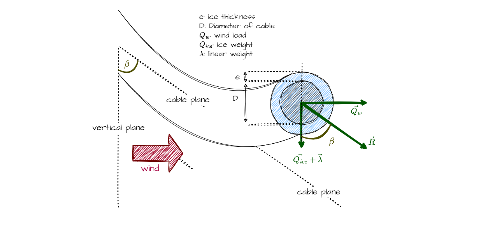

# Sag-tension calculations for dead-end span

## External loads

A cable is subject to three main types of external loads:

* The wind load, denoted as $Q_w$:

$$
   Q_w = P_w \cdot (D + 2 \cdot e)
$$

where $D$ is the cable diameter, $e$ the ice thickness and $P_w$ the wind pressure.

* The ice weight per unit length, denoted as $Q_{ice}$:

$$
   Q_{ice} = \rho_{ice} \cdot \pi \cdot e \cdot (e + D)
$$

where $D$ is the cable diameter, $e$ the ice thickness and $\rho_{ice}$ the ice density,
typically ranging from $2000$ to $9500\ \mathrm{N/m^3}$ (default value is $6000\ \mathrm{N/m^3}$).

* The cable linear weight, denoted as $\lambda$, that reflects the intrinsic weight of the cable per unit length.

Thus, the total resultant force $R$, acting on the cable, is calculated as:

$$
    R = \sqrt{(Q_{ice} + \lambda)^2 + Q_w^2}
$$

## Load coefficient

The load coefficient $m$ quantifies the impact of the external loads on the horizontal tension. It is defined as:

$$
    m = \frac{R}{\lambda}
$$

The connection between the sagging parameter $p$, the cable linear weight $\lambda$, and the horizontal tension $T_h$,
already defined in the [cable modeling section](ug_cable_model.md), is:

$$
    p = \frac{T_h}{m \cdot \lambda}
$$

## Load angle

The load angle $\beta$ indicates the direction of the resultant $R$:

$$
    \beta = \arctan \left( \frac{Q_w}{Q_{ice} + \lambda} \right)
$$

## Sag-tension calculation algorithm

We want to determine the new horizontal tension when additional loads and/or thermal changes are applied on the cable.
The steps are as follows:

* Update the cable plane by calculating the new angle ($\beta$).

* Adjust sagging parameters:
    - Compute $a'$ and $b'$ (adjusted span length and height difference)
    - Update the cable's effective length, $L'$

* Calculate the strain from two methods. The first method is from the reference length:

$$
    {\varepsilon_{total}}_L = \frac{\Delta L}{L_0} = \frac{L' - L_0}{L_0}
$$

And the second method from the strain-stress relationship:

$$
    {\varepsilon_{total}}_T = \frac{T_{mean}}{E \cdot S} + \theta \cdot \alpha_{th}
$$

* Determine the remaining error: since strain depends on $T_h$, determine the error function for iterative solutions:

$$
    f(T_h) = {\varepsilon_{total}}_L - {\varepsilon_{total}}_T
$$

## Example: resolution using Newton-Raphson method

To solve $f(T_h) = 0$ for horizontal tension:

* Approximate the derivative:

$$
   f'(T_h) \approx \frac{f(T_{h0} + \zeta) - f(T_{h0})}{\zeta}
$$

where $\zeta = 10\ \mathrm{N}$ is the step size.

* Iterative solution formula:

$$
   {T_h}_{n+1} = {T_h}_n - \frac{f({T_h}_n)}{f'({T_h}_n)}
$$

* Converge to the result: start with an initial guess ${T_h}_0 = T_{h0}$ and iterate until $f(T_h)$ approaches zero.